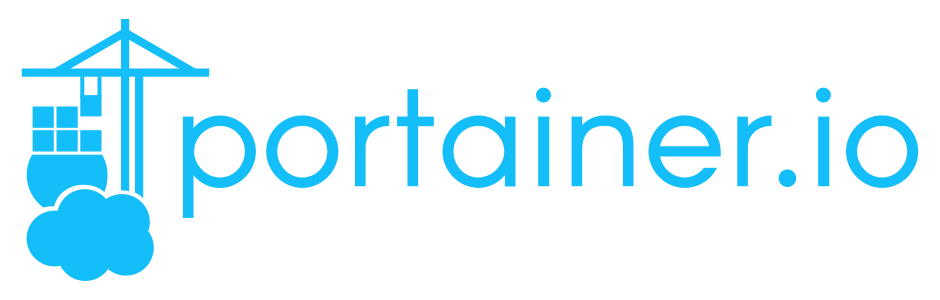

# FirstMatey 🦜
This is a home server for our docker containers, media, bots, and personal files. Docker Compose is used. I'm hosting this here as a source of information for myself and for others.

# Table of Contents 👷👷👷👷👷

## 1. [Portainer](#portainer)
## 2. [Pi-Hole](#pi-hole) 👷
## 3. [WireGuard](#wireguard) 👷
## 4. [Plex](#plex) 👷
## 5. [Sonarr](#sonarr) 👷
## 6. [Radarr](#radarr) 👷
## 7. [Jackett](#jackett) 👷
## 8. [Organizr](#organizr) 👷

## Portainer

This one is optional. Portainer is a container management tool. I'm mainly use the CLI but I keep this around when I need to manage something from my phone/tablet.
